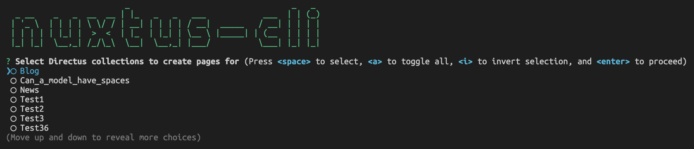

# CLI

The Nuxtus CLI is a command line interface for Nuxt that allows you to manually run some of the commands otherwise run automatically.

## Installation

If you installed the [Nuxtus Boilerplate](README.md#installation) then Nuxtus CLI is already installed, you can skip to the next section.

To manually install the Nuxtus CLI run the following *in the root of your Nuxt project*:

```bash	
npm i --save-dev @nuxtus/cli
```

## Configuration

In order for Nuxtus CLI to communicate with Directus you need to provide connection credentials. Again, this is done automatically for you if you are using the biolerplate but if not please continue with the instructions below.

Create a `.env` file in the root of your **Nuxt project** and add the following lines:

```env
# URL of your Directus instance
DIRECTUS_URL=http://localhost:8055
# Directus login credentials
NUXT_PUBLIC_DIRECTUS_EMAIL=admin@example.com
NUXT_PUBLIC_DIRECTUS_PASSWORD=password
```

## Usage

The CLI command comes with in built help commands that can be used to get more information about the commands. From your terminal simply:

```bash
nuxtus
```

You should see something similar to:


> Make sure Directus is running before you use the Nuxtus CLI.

For more details on a particular command:

```bash
nuxtus create -h # For help with the create command
```

## Creating pages

The Nuxtus CLI will read all the Collections in your Directus instance and can create Nuxt pages for each.

```bash
nuxtus create
```

You will be presented with a list of all the Directus Collections that have no corresponding Nuxt pages (with the Directus system collections removed). Simply select the Collections you want pages for (using the arrow keys and spacebar) and press enter to create the pages.



> For more details on the pages created see [using Nuxtus](using-nuxtus.md#using-directus-data)

## Updating Types

Nuxtus CLI can also provide Typescript with type information for the collection objects. Simply run the following command to update the type information:

```bash
nuxtus types
```

Nuxtus CLI will create an `/interfaces` folder in your Nuxt project that contains a `nuxtus.ts` file containing an interface to use for typing.

To make use of the interface file in your Nuxt pages and components:

```typescript
<script setup lang="ts">
  import { components } from "../../interfaces/nuxtus";
  type CollectionName = components["schemas"]["ItemsCollectionName"];
</script>
```

> Replace CollectionName with the name of your collection.